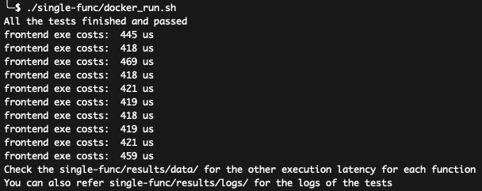
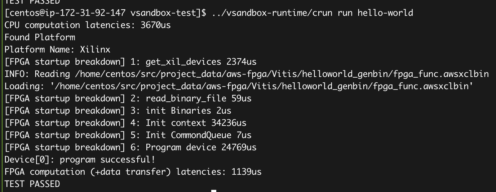
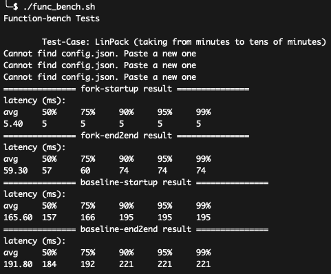
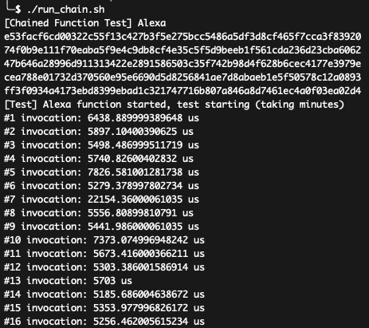
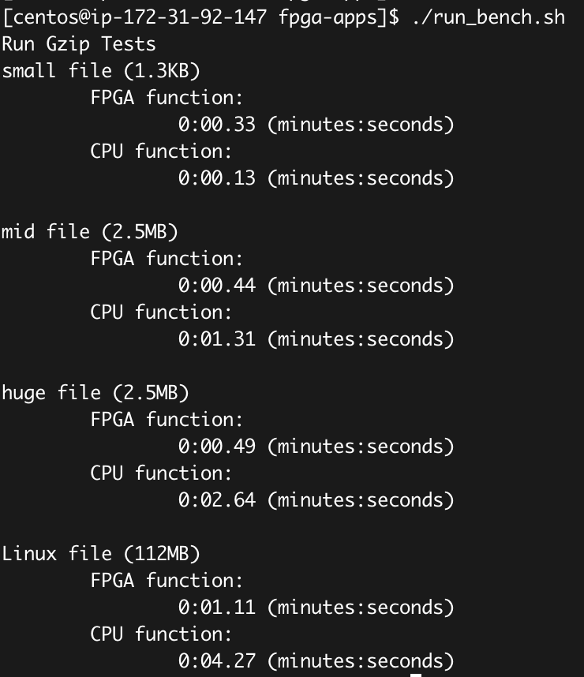
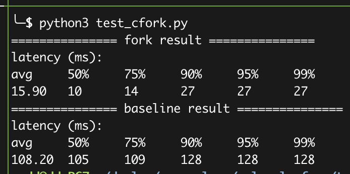
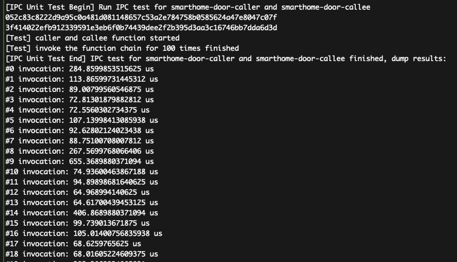
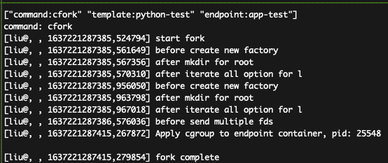
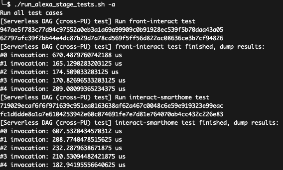
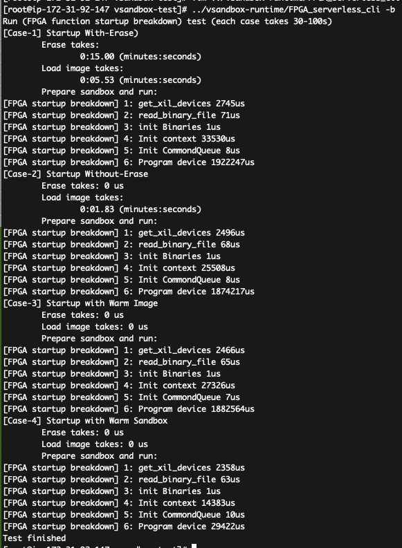

## Molecule: ASPLOS'22 Artifact

This artifact lays out the source code and experiment setup for the ACM ASPLOS 2022 conference paper:
*"Serverless Computing on Heterogeneous Computers".*

## 1. Introduction

Molecule is a serverless sandbox runtime allowing functions running on heterogeneous devices.

**Essential hardware requirements:**
- **CPU**: recommending x86 CPU, but ARM is OK. CPU is sufficient for most of the experiements in the artifact.
- **FPGA**: You need a computer which is equpped with (at-least) one FPGA card for FPGA-based functions.
AWS EC2 F1 instance (using AMI: ami-02155c6289e76719a) is perfectly for this case.
To ease AE reviewers do the experiments, **we have prepared an F1 instance that can be used during the AE period** (see hotcrp for the way to access the instance).

**Optional hardware requirements:**
- **DPU**: You need a computer (with x86 CPU cores) which is equipped with Nvidia Bluefield (both Bluefield-1 and Bluefield-2 are OK).
As DPU is a generic processor (using ARM CPU cores) and is abstracted by XPU-shim,
the experiments for CPU-DPU settings are almost the same as for CPU-only setting.
In the following cases, you will use CPU for the tests, but you can refer to
[Running experiments on CPU-DPU](./docs/experiments-on-DPU.md) if you have DPU and want to do experiments on that.


**Software requirements:**

1. Git: Molecule uses git for version control
2. Docker: Molecule uses docker to create the build environment
3. Linux: All the testing scripts are developed for Linux (Ubuntu-18.04/Ubuntu-20.04/CentOS Linux release 7.9.2009 are validated), which may be incompatible with mac or windows.
4. Golang: go version go1.15.5 (or higher) linux/amd64

All the software requirements are well-prepared in the provided F1 testbed.

You can do all the tests on the F1 instance, or just do the FPGA-related tests on F1 and others on your local environment.
In the following, we will explictly mark the tests that require an FPGA with :trophy: .


## 2. Getting started (artifact available and functional)

In this section, we will explain how to install Molecule and run a simple demo.

### 2.1. Install (available)

Molecule is an open-sourced project at: https://github.com/Molecule-Serverless.
As the project contains many components, e.g., container runtime supporting fork (i.e., runc)
and language runtimes like Python/Node.JS for functions,
we use sub-modules to manage them all in the artifact.

To get the source code of Molecule:

	git clone git@github.com:Molecule-Serverless/molecule-artifact.git
	cd molecule-artifact
	## Update all submodules:
	git submodule update --init --recursive

Download the basic software dependencies.

For Ubuntu:

	$ sudo apt-get install -y make git gcc build-essential pkgconf libtool \
	  libsystemd-dev libprotobuf-c-dev libcap-dev libseccomp-dev libyajl-dev \
   	  go-md2man libtool autoconf python3 automake

For CentOS:

	$ sudo yum --enablerepo='*' --disablerepo='media-*' --disablerepo=c7-media  install -y make automak \
	  autoconf gettext libtool gcc libcap-devel systemd-devel \
	  yajl-devel libseccomp-devel python36 libtool git


To build the Molecule's components (on x86 CPU):

	./build_all.sh

If everything goes fine, you have everything needed to run Molecule's tests and reproduce the results.

If you have DPU, or you are using ARM server, using the following command to build:

	./build_all_arm.sh

### 2.2. Run simple examples (functional)

This section uses two cases to illustrate Molecule's functionalities.

#### (1) Case for CPU/DPU hello-world function

We use the Alexa functions (from ServerlessBench) as a case.

Commands:

	# enter to the molecule-benchmarks dir
	cd ./molecule-benchmarks
	# Build runtime and functions
	./single-func/docker_build.sh
	# Run the simple tests
	./single-func/docker_run.sh

The script will run all alexa functions, and write data/log to single-func/results/.
You shall see the results like:



You can see the exe costs of frontend function when everything is fine.

#### (2) Case for FPGA hello-world function ( :trophy: )

The following instructions assume you are using the provided AWS EC2 F1 instance.
If you are using your own instance, please follow the
[Prepare FPGA environment](./docs/prepare-fpga-env.md) to prepare your environment first.
Otherwise, you are ready to do the experiments.

1. Install the molecule

If you have installed, skip the step.

	git clone git@github.com:Molecule-Serverless/molecule-artifact.git
	cd molecule-artifact
	## Update all submodules:
	git submodule update --init --recursive
	./build_all.sh

2. Prepare AWS F1 FPGA environment

In the molecule-artifact dir:

	source ./source_fpga_env.sh

3. Run the demo

Now you are ready to run the demos (vector multiplex example):

	cd molecule-benchmarks/fpga-apps
	## Taking upto minutes
	./run_demo.sh

You shall see the results like:



In the cold run, it is possible to use more time for FPGA;
while in the warm run, the FPGA should achieve about 3x better latency compared with CPU.

## 3. Main results of the paper (Reproducability)

In this part, we first explain instructions to run scripts that can
reproduce the results of benchmarks and applications used in the paper,
which shall give the reviewers/readers sufficient confiddence about
the reproducability.

Besides, we also explain detail steps on evaluate each techniques
(i.e., cfork and IPC-based DAG) in Molecule using microbenchmarks.
These steps are optional but can help reviewers/readers to identify
the major improvement of Molecule.

### (1) Benchmarks and Applications

#### To reproduce Functionbench results (Fig-14 a,b,c):

	cd molecule-benchmarks/function-bench
	./func_bench.sh

You shall see the results like:



The script will run all the test cases used in the paper, and shows the startup, end-to-end (cold boot),
and end-to-end (warm boot) latencies.

The above fig shows the results of Linpack.
Molecule can achieve significant better performance compared with the baseline.
The results match the data in the Figure-14.

**Note:**
Please ensure you have built Molecule using ./build_all.sh.


#### Chained Applications: Alexa

Commands:

	# enter to the molecule-benchmarks dir
	cd ./molecule-benchmarks
	# Build runtime and functions
	./chained-func/docker_build.sh
	# This script will run Alexa chained applications
	./chained-func/docker_run.sh

You shall see the results like:



#### To reproduce FPGA benchmark results (Fig-14 e, :trophy: ):

	cd molecule-benchmarks/fpga-apps
	./run_bench.sh

You shall see the results like:



The above fig shows the results of GZIP latency for FPGA ench-benchmarks.pngCPU, which totally match the result of Fig-14 (e).

If you have successfully run the above experiments and get the expected results,
congradulation! you have done most of the work!

In the following, we will explain the detailed instructions to run each (optional) microbenchmarks.
All test cases are self-contained, that means you can directly select and run the cases that you are interested!

### (2) cFork (for CPU or DPU)

This section shows how to reproduce results in Figure-10 (a) and (b).

* Ensure you have built Molecule using ./build_all.sh

* Run tests
``` bash
cd forkable-python-runtime/scripts
./kill_containers.sh # make sure that no old container exists

./base_build.sh # build baseline container's bundle

./template_build.sh # build template container's bundle
./endpoint_build.sh # build endpoint container's bundle

# test baseline works
./run_baseline.sh

# test cfork works
./run_fork.sh

# usage: python3 test_cfork.py [test]
# test can be baseline or fork
# if no test is specified, it runs all tests by default
# Caution: if the test is "fork", please make sure that you have run ./run_fork.sh successfully to warm up the environment
python3 test_cfork.py
```

You shall see the results like:



### (3) IPC-based DAG (for CPU or DPU)

We prepare scripts to run chained serverless functions and generate the
communication latency, as the Figure-12 in the paper.

Commands:

	# Enter molecule-benchmarks
	cd molecule-benchmarks
	./staged-func/docker_build.sh
	# This script will run all the four cases (in Figure-12)
	./staged-func/docker_run.sh

You shall see the results like:



This confirms the claims in the paper that IPC-based DAG communication
can achieve significant lower latency (about 100--500us in most cases)
compared with baseline.


### (4) cFork using neighborIPC

The below instructions assum you do not have a DPU, so we will do the cFork on
the single CPU node.
However, unlike the above case, we will start an XPU-shim, which provides the
neighborIPC interfaces for the cFork to use.
The same case can be transparently run on a CPU-DPU setting, in which case you should
start two XPU-shim and assigning them different IDs.

In this case, we will rely on neighborIPC provided by XPU-shim to fork on an instance.

1. Ensure you have built Molecule using ./build_all.sh

2. Start the XPU-shim on local node

Commands:

	cd xpu-shim/src/
	sudo ./moleculeos -i 0

This command will start an XPU-shim node which will blocking the terminal.

Try to start another terminal for the following instructions.

3. Start Molecule-worker on each PU:

Commands:

	sudo ./runc/runc runtime

You will see the runtime is now connected to the XPU-shim.


4. Run the tests

In another terminal (or another PU if you have other PUs like DPU):

	cd forkable-python-runtime/scripts
	./base_build.sh # build baseline container's bundle
	cd ../../
	cd moleculeruntimeclient
	make
	sudo ./molecule_rpc_client run -i 1 -c python-test -b ~/.base/container0
	sudo ./molecule_rpc_client run -i 1 -c app-test -b ~/.base/spin0

Now you can fork the instances on remote PU:

	sudo ./molecule_rpc_client cfork -i 1 -t python-test -p app-test

You shall see the results like:




This confirms the claims in the paper (Figure-11-a) that the cFork can achieve
about 30ms even in cross-PU settings.

**Note:** we do not apply the kernel optimization (CPUset opt), which is the biggest
costs as shown in the breakdown in the above figure.

### (5) IPC-based DAG using neighborIPC

The below instructions assum you do not have a DPU, so we will do the DAG communication
on the single CPU node.
However, unlike the above case, we will start an XPU-shim, which provides the
neighborIPC interfaces for the IPC-based DAG to use.
The same case can be transparently run on a CPU-DPU setting, in which case you should
start two XPU-shim and assigning them different IDs.

1. Ensure you have built Molecule using ./build_all.sh

2. Start the XPU-shim on local node

Commands:

	cd xpu-shim/src
	sudo ./moleculeos -i 0

3. Run benchmarks:

Commands:

	cd molecule-js-env && git checkout hetero_ipc_neighborIPC
	cd src/tests/ipc/stages/
	# This script will run all the four cases (in Figure-12)
	./run_alexa_stage_tests.sh -a

You shall see the results like:



This confirms the claims in the paper that XPU-shim's neighbor IPC
can help functions on different PU to achieve low communication latency
(about 150--600us in most cases).

### (6) FPGA function startup breakdown ( :trophy: )

This section shows how to reproduce results in Figure-10 (c).

1. Ensure you have built Molecule using ./build_all.sh

2. Run the tests

Commands:

	# In the vsandbox-runtime dir:
	cd vsandbox-runtime
	mkdir vsandbox-test && cd vsandbox-test
	../vsandbox spec
	## The following command will run all the tests
	../FPGA_serverless_cli -b

After that, you shall see the results like (including startup latency of four cases):




Specifically:

* in the first case, the total latency is 15+5.53+2 = 22.52s in the figure, which matches the 1st bar in Figure-10(c);
* in the second case, the total latency is 1.83+1.9=3.73s, which matches the 2nd bar in Figure-10(c);
* in the third case, the total latency is 1.9s, which matches the 3rd bar in Figure-10(c);
* in the fourth case, the total latency is 46ms, which matches the 4th bar in Figure-10(c).

### (7) Other test cases

#### Chained Applications: Mapper-Reducer

Follow the instructions in pychain/README.md.


## Acknowledgements

We thank all of our reviewer, AE reviewers for their insightful comments!

* If you thought the artifact is well-organized, functional, and easy-to-reproduce,
consider champain the artifact, thanks in advance.
* If you thought there are still many things to improve,
please (anonymously) give the feedbacks through hotCRP.

We are open and welcome developers and researchers to help us to
improve the project.
