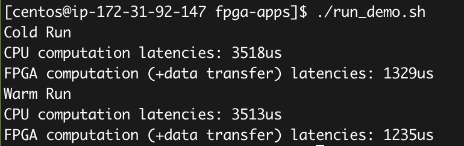
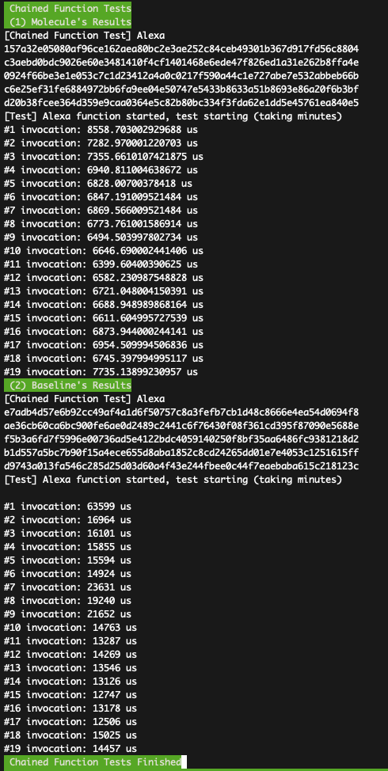
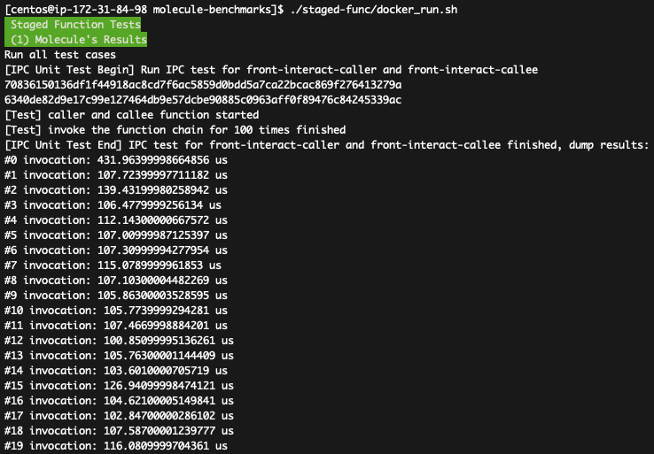

## Molecule: ASPLOS'22 Artifact

This artifact lays out the source code and experiment setup for the ACM ASPLOS 2022 conference paper:
*"Serverless Computing on Heterogeneous Computers".*

## 1. Introduction

Molecule is a serverless runtime allowing functions running on heterogeneous devices.
Specifically, we currently support CPU-DPU and CPU-FPGA platforms.

**Hardware requirements:**
- CPU-DPU: You need a computer (with x86 CPU cores) which is equipped with Nvidia Bluefield (both Bluefield-1 and Bluefield-2 are OK).
- CPU-FPGA: You need a computer which is equpped with FPGA card. AWS EC2 F1 instance is perfectly to evalaute this secenario.

To ease AE reviewers quickly build, run, and evaluate Molecule, we have prepared:
- a simulation mode that can using two XPU-Shim in a single CPU to simulate CPU-DPU settings;
- an F1 instance that can be accessed to run cases for CPU-DPU.

**Software requirements:**

1. Git: Molecule uses git for version control
2. Docker: Molecule uses docker to create the build environment
3. Linux: All the testing scripts are developed for Linux (e.g., ubuntu-20.04 we used), which may be incompatible with mac or windows.

All the software requirements are well-prepared in the provided F1 testbed.

## 2. Getting started (artifact available and functional)

In this section, we will explain how to install Molecule and run a simple demo.

### 2.1. Install (available)

Molecule is an open-sourced project at: https://github.com/Molecule-Serverless.
As the project contains many components, e.g., container runtime supporting fork (i.e., runc)
and language runtimes like Python/Node.JS for functions,
we use sub-modules to manage them all in the artifact.

To get the source code of Molecule:

	git clone git@github.com:Molecule-Serverless/molecule-artifact.git
	cd molecule-artifact
	## Update all submodules:
	git submodule update --init --recursive

To build the Molecule's components (on x86 CPU):

	./build_all.sh

If everything goes fine, you have everything needed to run Molecule's tests and reproduce the results.

If you have DPU, or you are using ARM server, using the following command to build:

	./build_all_arm.sh

### 2.2. Run simple examples (functional)

This section uses two cases to illustrate Molecule's functionalities.

#### (1) Case for CPU/DPU hello-world function

We use the Alexa functions (from ServerlessBench) as a case.

Commands:

	# enter to the molecule-benchmarks dir
	cd ./molecule-benchmarks
	# Build runtime and functions
	./single-func/docker_build.sh
	# Run the simple tests
	./single-func/docker_run.sh

The script will run all alexa functions, and write data/log to single-func/results/.
You shall see the results like:


You can see the exe costs of frontend function when everything is fine.

#### (2) Case for FPGA hello-world function

The following instructions assume you are using the provided AWS EC2 F1 instance.
If you are using your own instance, please follow the
[Prepare FPGA environment](./docs/prepare-fpga-env.md) to prepare your environment first.
Otherwise, you are ready to do the experiments.

1. Install the molecule

If you have installed, skip the step.

	git clone git@github.com:Molecule-Serverless/molecule-artifact.git
	cd molecule-artifact
	## Update all submodules:
	git submodule update --init --recursive
	./build_all.sh

2. Prepare AWS F1 FPGA environment

In the molecule-artifact dir:

	source ./source_fpga_env.sh

3. Run the demo

	cd molecule-benchmarks/fpga-apps
	# Taking upto minutes
	./run_demo.sh

You shall see the results like:



## 3. Main results of the paper (Reproducability)

In this part, we first explain instructions to run scripts that can
reproduce the results of benchmarks and applications used in the paper,
which shall give the reviewers/readers sufficient confiddence about
the reproducability.

Besides, we also explain detail steps on evaluate each techniques
(i.e., cfork and IPC-based DAG) in Molecule using microbenchmarks.
These steps are optional but can help reviewers/readers to identify
the major improvement of Molecule.

### 3.1 Benchmarks and Applications

**To reproduce functionbench results (Fig-14 a,b,c)**:

	cd molecule-benchmarks/function-bench
	./func_bench.sh

You shall see the results like:


The script will run all the test cases used in the paper, and shows the startup, end-to-end (cold boot),
and end-to-end (warm boot) latencies.

The above fig shows the results of Linpack.
Molecule can achieve significant better performance compared with the baseline.
The results match the data in the Figure-14.


**Note:**
Please ensure you have built runc before (in runc/).


**Chained Applications: Alexa**

Commands:

	cd molecule-js-env && git checkout hetero_ipc
	cd src/tests/ipc/chain/
	# This script will run Alexa chained applications
	./run_chain.sh

You shall see the results like:




**Chained Applications: Mapper-Reducer**

Follow the instructions in pychain/README.md.


**To reproduce FPGA benchmark results (Fig-14 e,f,g)**:

	cd molecule-benchmarks/fpga-apps
	./run_bench.sh

You shall see the results like:


The above fig shows the results of GZIP latency for FPGA and CPU, which totally match the result of Fig-14 (e).

### 3.2 cFork on single-PU (e.g., CPU or DPU)

This section shows how to reproduce results in Figure-10 (a) and (b).

* Prepare Molecule's runc (which supports cFork)
``` bash
cd runc
git checkout c12a5deed022ada93f499cc90fed54a23f0eb4d9
make static

```

* Prepare forable-python-runtime  environment
``` bash
cd forkable-python-runtime
# change the config of the runc path
cd scripts
vim config
# modify RUNC to your path of the compiled runc

```

* Run tests
``` bash
cd forkable-python-runtime/scripts
./kill_containers.sh # make sure that no old container exists

./base_build.sh # build baseline container's bundle

./template_build.sh # build template container's bundle
./endpoint_build.sh # build endpoint container's bundle

# test baseline works
./run_baseline.sh

# test cfork works
./run_fork.sh

# usage: python3 test_fork.py [test]
# test can be baseline or fork
# if no test is specified, it runs all tests by default
# Caution: if the test is "fork", please make sure that you have run ./run_fork.sh successfully to warm up the environment
python3 test_fork.py
```

You shall see the results like:


### 3.3 IPC-based DAG on single-PU (e.g., CPU or DPU)

We prepare scripts to run chained serverless functions and generate the
communication latency, as the Figure-12 in the paper.

Commands:

	cd molecule-js-env && git checkout hetero_ipc
	cd src/tests/ipc/stages/
	# This script will run all the four cases (in Figure-12)
	./run_alexa_stage_tests.sh -a

You shall see the results like:




This confirms the claims in the paper that IPC-based DAG communication
can achieve significant lower latency (about 100--500us in most cases)
compared with baseline.


### 3.4 cFork on cross-PU (e.g., CPU-CPU or CPU-DPU)

In this case, we will rely on neighborIPC provided by XPU-shim to fork on an instance.


Build and run XPU-shim:

	cd xpu-shim/src
	make -j8
	# create the shared dir used to communicate between XPU-shim and functions
	sudo mkdir -p /tmp/fifo_dir
	sudo ./moleculeos -i 0

Start Molecule-worker on each PU:

	cd runc && git checkout molecule-cfork
	make static
	sudo ./runc runtime

You will see the runtime is now connected to the XPU-shim.


In another PU (or the same PU if you just simulate two PUs on the same CPU):

	cd forkable-python-runtime/scripts
	./base_build.sh # build baseline container's bundle
	cd ../../
	cd moleculeruntimeclient
	make
	sudo ./molecule_rpc_client run -i 1 -c python-test -b ~/.base/container0
	sudo ./molecule_rpc_client run -i 1 -c app-test -b ~/.base/spin0

Now you can fork the instances on remote PU:

	sudo ./molecule_rpc_client cfork -i 1 -t python-test -p app-test

You shall see the results like:


This confirms the claims in the paper (Figure-11-a) that the cFork can achieve
about 30ms even in cross-PU settings.

**Note:** we do not apply the kernel optimization (CPUset opt), which is the biggest
costs as shown in the breakdown in the above figure.
We provide the patch in TODO_DIR, and users can feel free to apply and test the patch
if they would.

### 3.5 IPC-based DAG on cross-PU (e.g., CPU-CPU or CPU-DPU)

The steps are similiar to 4.2 o evaluate DAG performance on cross-PU.
The major change is to prepare a XPU-shim in advance before running benchmarks.

Build and run XPU-shim:

	cd xpu-shim/src
	make -j8
	# create the shared dir used to communicate between XPU-shim and functions
	sudo mkdir -p /tmp/fifo_dir
	sudo ./moleculeos -i 0

Run benchmarks:

	cd molecule-js-env && git checkout hetero_ipc_neighborIPC
	cd src/tests/ipc/stages/
	# This script will run all the four cases (in Figure-12)
	./run_alexa_stage_tests.sh -a

You shall see the results like:


This confirms the claims in the paper that XPU-shim's neighbor IPC
can help functions on different PU to achieve low communication latency
(about 150--600us in most cases).

### 3.6 FPGA function startup breakdown

This section shows how to reproduce results in Figure-10 (c).

**Note:** We assume the vsandbox is correctly compiled. If it is not, please do it following the instructions above.

Commands:

In the vsandbox-runtime dir:

	mkdir vsandbox-test && cd vsandbox-test
	../vsandbox-runtime spec
	## The following command will run all the tests
	../FPGA_serverless_cli -b

After that, you shall see the results like (including startup latency of four cases):


Specifically:

* in the first case, the total latency is 15+5.53+2 = 22.52s in the figure, which matches the 1st bar in Figure-10(c);
* in the second case, the total latency is 1.83+1.9=3.73s, which matches the 2nd bar in Figure-10(c);
* in the third case, the total latency is 1.9s, which matches the 3rd bar in Figure-10(c);
* in the fourth case, the total latency is 46ms, which matches the 4th bar in Figure-10(c).

